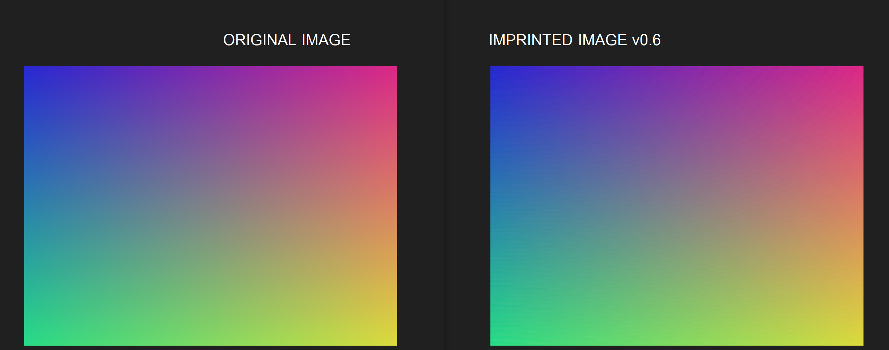

# Imprint — Perceptual, Camera-Robust Data in Images (WIP)



Imprint is a research prototype for **embedding small amounts of structured data into ordinary images** so that:

* The changes are **hard to notice by humans** under normal viewing.
* The data can be **recovered from screenshots or re-photographs** (not just by reading file metadata).
* The scheme can be extended with **authentication (signatures, timestamping, ledger proofs)** for evidentiary use.

> Status: early prototype. The code intentionally favors clarity over speed. Formats and CLIs are subject to change.

---

## Why another “watermark”?

Most “invisible watermark” systems push bits into frequency coefficients (e.g., JPEG DCT), which is brittle when images are re-shot from a screen, printed and scanned, or run through aggressive filters. Imprint approaches the problem *from the color side*: we define **sets of color variants that are perceptually the same to a human** (within a ΔE threshold) and use *which* variant is chosen to carry information. Think of it as “**same color, different coordinates**.”

---

## Core Ideas

### 1) Canonical Variant Palette (CVP)

For any input color, we deterministically compute a **voxel** in CIE Lab space (a coarse cell). Inside that voxel we create:

* A **canonical/default color** (index 0) — the perceptual “center”.
* A fixed, ordered list of **alternate variants** (indices 1..K) that stay inside the same voxel and within a small ΔE of the canonical.
  These variants look the same to humans but are numerically different to a computer.

This ordered list is the **CVP**. The **Imprint Order Index (iOI)** of a pixel is just the index in this CVP (default is “null”; alternates map to 0,1,2,… for carrying symbols).

> Determinism guarantee: no matter which CVP member you start from (or small perturbations around them), you recover the exact same ordered CVP list.

### 2) Imprint Pixel Squares (iPS)

We work in tiles of size **w×w** pixels (argument: `-w`, often 10–20). Each tile contains many pixels of similar color; we quantize each pixel to the **default** CVP color (normalization), then choose a **single CVP variant index** for the *whole tile* to encode a symbol. Using per-tile symbols provides redundancy and robustness.

### 3) Targetable Affine Corner Finder (TACF)

To survive re-photography, we add three high-contrast **corner markers** (top-left, top-right, bottom-left). They allow the decoder to:

* detect the region-of-interest,
* estimate perspective/rotation/scale,
* recover the iPS grid.

Marker size is controlled by **iCP** (an integer multiplier of iPS): e.g., iPS=14 and iCP=5 → 70×70 corner squares.

### 4) Adaptive Radix per Tile (planned)

Each tile can have different numbers of safe CVP variants (depends on local color & gamut). Instead of forcing a global base (e.g., pure bits), the encoder will choose a **per-tile radix** (3..16 symbols typical) and pack data with FEC (Reed–Solomon) across the stream.

---

## What’s in this repo (prototype modules)

* `utils/cvp.py`
  Deterministic CVP generator and strip IO.

  * **Generate** CVP list from a color, optionally render a strip image.
  * **Read** a CVP strip back and verify invariance.
* `utils/normalizer.py`
  Snap every pixel in an image to the **default** member of its CVP (human-similar baseline).

  * Also provides a **sanity checker** that reports whether an image is fully normalized.
* `utils/tile_grid.py`
  Split an image into **w×w** tiles (as centered as possible) and optionally render grid lines for visualization.
* `utils/tacf.py`
  Draw the three **TACF** corner markers sized by `iCP` and aligned to the grid.
* `test.py`
  Convenience script to render a canvas with TACF and a blank tile grid.
* `imprint.py` (earlier PoC)
  First pass encoder/decoder; kept for reference. Newer workflows prefer the utils above and will bring back encode/decode as we stabilize headers and FEC.

---

## Install

```bash
python -m venv .venv
# Windows
.\.venv\Scripts\activate
# macOS/Linux
source .venv/bin/activate

pip install -U pip
pip install numpy pillow opencv-python
# (reedsolomon/FEC will be added when we enable it; currently not required)
```

---

## Quickstart: CVP Basics

Generate the CVP list for a color and render a strip:

```bash
python utils/cvp.py "#66cc99" --out ./example_img/cvp_strip.png --w 40
```

Read the strip back and verify invariance:

```bash
python utils/cvp.py --from_strip ./example_img/cvp_strip.png --w 40
```

Example output (abridged):

```json
{
  "mode": "generate",
  "count": 9,
  "cvps": [
    {"index":"default","rgb":[...],"hex":"#..."},
    {"index":0,"rgb":[...],"hex":"#..."},
    {"index":1,"rgb":[...],"hex":"#..."}
  ],
  "image": "./example_img/cvp_strip.png"
}
```

---

## Normalize an Image (build a “base”)

Normalize every pixel to its **default CVP** (this yields an image perceptually close to the original, but numerically aligned for embedding):

```bash
python utils/normalizer.py ./example_img/demo_in.png ./example_img/demo_base.png \
  --stepL 8 --stepa 12 --stepb 12 --deltaE 1.0
```

Check whether an image is fully normalized:

```bash
python utils/normalizer.py ./example_img/demo_base.png --check
# -> reports "normalized": true/false and (optionally) a map of offending pixels
```

> Tuning invisibility vs. capacity:
>
> * Larger voxel steps (`--stepL/--stepa/--stepb`) and smaller `--deltaE` make the “base” closer to the original (less visible drift), but reduce how many safe variants each tile gets.
> * Start with `--stepL 8 --stepa 12 --stepb 12 --deltaE 1.0`. If you still see visible drift, increase steps a little or drop `deltaE` to `0.8`.

---

## Make a Tile Grid (iPS)

Split an image into **w×w** tiles and (optionally) render grid lines for inspection:

```bash
python utils/tile_grid.py ./example_img/demo_base.png \
  --w 14 \
  --grid_out ./example_img/demo_base_grid.png \
  --json_out ./example_img/demo_base_grid.json
```

* `--w` is your **iPS** size.
* `--grid_out` saves a copy with visible lines (debugging only).
* `--json_out` lists the grid geometry (rows, cols, tile rectangles).

---

## Add TACF Corner Markers (iCP)

Draw the three calibration markers sized by an integer **iCP** multiplier of iPS:

```bash
python utils/tacf.py ./example_img/demo_base.png ./example_img/demo_tacf.png \
  --w 14 --iCP 5 --style classic
```

* Markers are placed at top-left, top-right, bottom-left.
* The decoder will use these to unwarp, align, and recover the grid.

---

## Compose a Canvas with TACF and Grid (demo)

Render a synthetic canvas that contains TACF + grid (no payload yet):

```bash
python test.py \
  --w 14 --iCP 5 \
  --W 1024 --H 768 \
  --out ./example_img/canvas.png
```

---

## Roadmap (next steps)

* **Adaptive radix per tile** (current utils already expose per-tile CVP size; the encoder will pack symbols using as many variants as are safely available for that tile).
* **Header design**: magic + version + layout parameters (w, iCP), content digest; salted and optionally encrypted payload.
* **FEC**: Reed–Solomon across the symbol stream; interleaving across rows/cols to survive localized damage.
* **Robust decoding**:

  * TACF detection → homography → grid recovery.
  * Photometric normalization (white balance, gamma) before CVP decisions.
  * Multi-hypothesis testing on CVP index per tile with confidence reduction.
* **Security** (optional layers):

  * Detached **manifest** (what was embedded) and **signature** (Ed25519).
  * **Timestamp token** (TSA HMAC or RFC 3161).
  * **Transparency log** (Merkle inclusion proof) to prove the imprint existed at a past time.
* **Human-factor tuning**:

  * Psychovisual masks to choose tiles where changes are maximally hidden.
  * Spatial dithering to reduce block boundary salience.

---

## Current Limitations

* The “base/normalized” image may still be distinguishable from the original on flat gradients or large smooth areas. Mitigations:

  * Use larger Lab voxel steps and smaller ΔE for the base.
  * Prefer textures; avoid flat fills if strong invisibility is required.
* Decoding from prints/re-photos is not implemented yet; TACF exists, but the end-to-end homography + symbol inference is in progress.
* The legacy `imprint.py` encoder/decoder is experimental and will be replaced by the adaptive-radix pipeline.

---

## Practical Use Cases (target)

* **Provenance & anti-tamper**: bind time, device, and location into pixels; verify even after screenshots/recompression.
* **Chain-of-custody**: couple a photo to a case ID with a verifiable ledger entry.
* **Soft DRM & leak forensics**: encode a short session or user ID robustly.

> Reminder: cryptographic binding (signatures, logs) turns “this image contains bits” into “this image claims X, signed by Y, seen at time T.” The pixels carry the bits; the proofs make them meaningful.

---

## Example End-to-End (today’s prototype)

1. **Normalize** the image:

```bash
python utils/normalizer.py ./example_img/demo_in.png ./example_img/demo_base.png \
  --stepL 8 --stepa 12 --stepb 12 --deltaE 1.0
```

2. **Grid** and **markers**:

```bash
python utils/tile_grid.py ./example_img/demo_base.png --w 14 \
  --grid_out ./example_img/demo_base_grid.png \
  --json_out ./example_img/demo_base_grid.json

python utils/tacf.py ./example_img/demo_base.png ./example_img/demo_tacf.png \
  --w 14 --iCP 5
```

3. **(Soon)** Encode a short message with adaptive radix per tile and export a manifest.
4. **(Soon)** Decode from the TACF + grid, recover message + verify manifest.

---

## Design Choices & Tuning Notes

* **Color space**: CIE Lab for perceptual uniformity.
* **Voxelization**: `(stepL, stepa, stepb)` define buckets; any input in the same bucket yields the same CVP list.
* **ΔE tolerance**: bounds how far variants may wander from the canonical center.
* **Invisibility levers**:

  * Higher `step*` and lower `ΔE` → closer to the original appearance (fewer variants).
  * Lower `step*` and higher `ΔE` → more variants (capacity) but increased risk of visible hue/contrast shifts.
* **Human vision**: ΔE ≈ 1 is near just-noticeable difference under ideal viewing; many displays/printers/phones are noisier than that. Start conservative and test on your target pipeline (screenshot, print, compress).

---

## Troubleshooting

* **“The normalized image still looks different.”**
  Increase `--stepL/--stepa/--stepb` and/or reduce `--deltaE`. For very flat backgrounds, consider texture-preserving masks (coming soon).
* **“Grid won’t fit nicely.”**
  Try a smaller `-w`. The grid aligns itself centered; we pad/clip as needed.
* **“Decoder can’t find markers.”**
  Ensure TACF is present and large enough (`iCP ≥ 4` for small images). Avoid cropping.

---

## Contributing

Open issues with:

* A minimal input image,
* Exact command lines,
* The observed vs. expected behavior.

The code is intentionally modular; PRs that improve determinism, decoding robustness, or human-factors are welcome.

---

## License

TBD for the research phase. All rights reserved for now; contact the maintainers for evaluation/commercial discussions.

---

## Glossary

* **CVP** — Canonical Variant Palette (ordered list of perceptually-equivalent color variants; index 0 is the canonical/default).
* **iOI** — Imprint Order Index (tile’s chosen CVP index used to encode a symbol; default is “null,” alternates map to 0,1,2,…).
* **iPS** — Imprint Pixel Square (tile size `w×w` used as one symbol carrier).
* **iCP** — Imprint Corner Pixel multiplier (marker size in multiples of `w`).
* **TACF** — Targetable Affine Corner Finder (three corner markers for alignment).
* **ΔE** — Perceptual color difference (CIE76 in this prototype).
* **FEC** — Forward Error Correction (Reed–Solomon planned).

---

*This document evolves with the prototype. If something is unclear or you want a worked example tailored to your image set (e.g., medical scans, body cams, receipts), that’s the perfect next experiment.*
